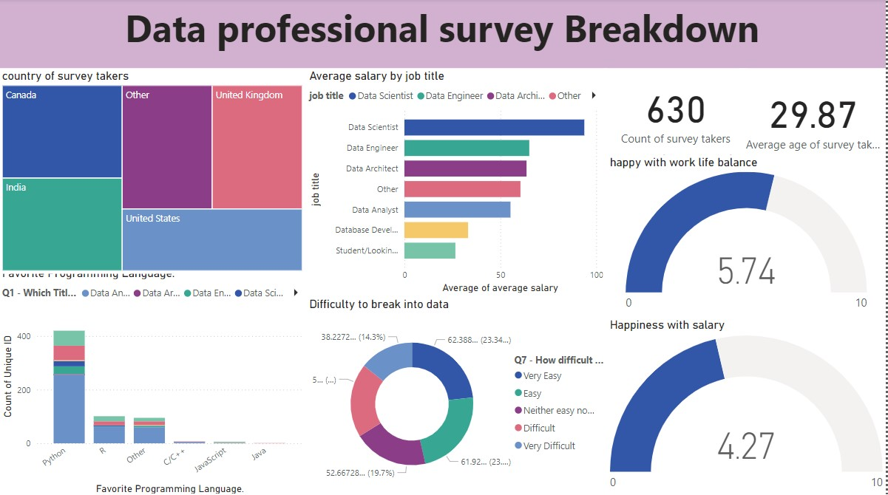

# Data Professional Survey Breakdown

## Overview
This project analyzes key insights from a survey of 630 data professionals, focusing on demographics, job satisfaction, salary distribution, and entry challenges in the data industry.

## Data Cleaning and Preparation
- **Empty Columns Removed**: Streamlined dataset.
- **Average Salary Calculation**: Standardized salary ranges.
- **Standardized Categories**: Consolidated variations of "Other".

## Conclusion
The survey reveals insights into the data profession, emphasizing the importance of Python and suggesting areas for improving job and salary satisfaction.

## Dataset
[Click here to download the project dataset](project_dataset.xlsx).
